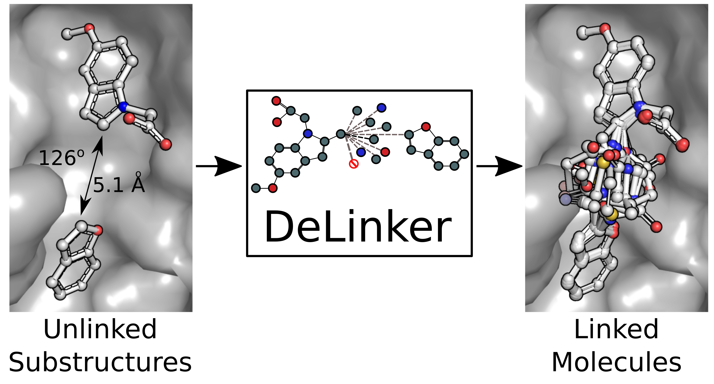

# DeLinker - Deep Generative Models for 3D Linker Design



This repository contains our implementation of [Deep Generative Models for 3D Linker Design](https://pubs.acs.org/doi/10.1021/acs.jcim.9b01120) (DeLinker). 

If you found DeLinker useful, please cite our paper:

Imrie F, Bradley AR, van der Schaar M, Deane CM. Deep Generative Models for 3D Linker Design. Journal of Chemical Information and Modeling. 2020

```
@Article{Imrie2020,
author={Imrie, Fergus and Bradley, Anthony R. and van der Schaar, Mihaela and Deane, Charlotte M.},
title={Deep Generative Models for 3D Linker Design},
journal={Journal of Chemical Information and Modeling},
year={2020},
month={Mar},
day={20},
publisher={American Chemical Society},
issn={1549-9596},
doi={10.1021/acs.jcim.9b01120},
url={https://doi.org/10.1021/acs.jcim.9b01120}
}
```

# Acknowledgements

We thank the authors of [Constrained Graph Variational Autoencoders for Molecule Design](https://papers.nips.cc/paper/8005-constrained-graph-variational-autoencoders-for-molecule-design) for releasing their code. The code in this repository is based on their source code release ([link](https://github.com/microsoft/constrained-graph-variational-autoencoder)). If you find this code useful, please consider citing their work.

# Requirements

This code was tested in Python 3.6 with Tensorflow 1.10. 

A yaml file containing all requirements is provided. This can be readily setup using conda.

```
conda env create -f DeLinker-env.yml
conda activate DeLinker-env
```

# Data Extraction

Two primary datasets (ZINC and CASF) are in use.

To preprocess these datasets, please go to `data` directory and run `prepare_data.py`.

```
python prepare_data.py
```

# Running DeLinker

We provide two settings of DeLinker. The first setting generates linkers with the same number of atoms as the reference molecule. The second setting generates linkers with a specified number of atoms. 

To train and generate molecules using the first setting, use:

```
python DeLinker.py --dataset zinc --config '{"num_epochs": 10, "epoch_to_generate": 10, "train_file": "data/molecules_zinc_train.json", "valid_file": "data/molecules_zinc_valid.json"}'
```

To generate molecules with a pretrained model using the first setting, use

```
python DeLinker.py --dataset zinc --restore models/pretrained_DeLinker_model.pickle --config '{"generation": true, "number_of_generation_per_valid": 250, "batch_size": 1, "train_file": "data/molecules_zinc_test.json", "valid_file": "data/molecules_zinc_test.json"}'
```

To generate molecules using the second setting, use

```
python DeLinker_test.py --dataset zinc --restore models/pretrained_DeLinker_model.pickle --config '{"generation": true, "number_of_generation_per_valid": 250, "batch_size": 1, "train_file": "data/molecules_zinc_test_mode2.json", "valid_file": "data/molecules_zinc_test_mode2.json", "min_atoms": 3, "max_atoms": 11}'
```

In both cases, the output is of the following format:

```
Input fragments (SMILES) Ground truth molecule/fragments (SMILES) Generated molecule (SMILES)
```

More configurations can be found at function `default_params` in `DeLinker.py`.

# Evaluation

A script to evaluate the generated molecules is provided in `analysis` directory.

```
python evaluate_generated_mols.py ZINC|CASF PATH_TO_GENERATED_MOLS PATH_TO_REFERENCE_MOLS ../data/data_zinc_final_train.txt SAVE_PATH OUTPUT_NAME NUM_CORES True None ./wehi_pains.csv >> log.txt
```

# Pretrained Models and Generated Molecules

We provide a pretrained model:

```
models/pretrained_DeLinker_model.pickle
```

Generated molecules can be obtained upon request.

# Examples

An example Jupyter notbook demonstrating the use of DeLinker for fragment linking can be found in the `examples` directory.

# Contact (Questions/Bugs/Requests)

Please submit a Github issue or contact Fergus Imrie [imrie@stats.ox.ac.uk](mailto:imrie@stats.ox.ac.uk).
